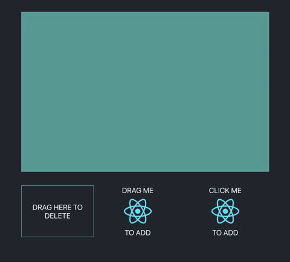

# react-transformable-draggable

### Description

A set of component wrappers to make any component or element draggable, droppable, and transformable.



### Installation

```sh
$ npm install react-transformable-draggable
$ yarn add react-transformable-draggable
```

### Example Usage

```
import React, { useState } from 'react'
import _ from 'lodash-uuid'
import {
    DeleteTarget,
    DndProvider,
    Droppable,
    Transformable,
    TransformableTarget,
} from 'react-transformable-draggable'
...

const renderItem = (
    <div className="app-render-item">
        CLICK ME
        
        TO ADD
    </div>
)

export const Example = () => {
    const [deleteClassName, setDeleteClassName] = useState('app-delete-target')
    const [renderItems, setRenderItems] = useState([])

    const onDelete = (id, type) => {
        console.log('deleted type: ', type)
        const updatedRenderItems = renderItems.filter(item => item.id !== id)

        setRenderItems(updatedRenderItems)
    }

    const onHoverEnd = () => {
        setDeleteClassName('app-delete-target')
    }

    const onHoverStart = () => {
        setDeleteClassName('app-delete-target--hover')
    }

    return (
        <div className="app">
            <DndProvider>
                <TransformableTarget className="app-transformable-target">
                    {renderItems.map(({ id, renderItem }) => (
                        <Transformable key={id} id={id} type="CLICK_TO_ADD">
                            {renderItem}
                        </Transformable>
                    ))}
                </TransformableTarget>
                <div className="app-toolbar">
                    <DeleteTarget
                        onDelete={onDelete}
                        onHoverStart={onHoverStart}
                        onHoverEnd={onHoverEnd}
                    >
                        <div className={deleteClassName}>DRAG HERE TO DELETE</div>
                    </DeleteTarget>
                    <div className="app-add-items">
                        <Droppable type="DRAG_TO_ADD">
                            <div className="app-render-item">
                                DRAG ME
                                
                                TO ADD
                            </div>
                        </Droppable>
                        <div
                            onClick={() =>
                                setRenderItems([...renderItems, { renderItem, id: _.uuid() }])
                            }
                        >
                            <div className="app-render-item">
                                CLICK ME
                                
                                TO ADD
                            </div>
                        </div>
                    </div>
                </div>
            </DndProvider>
        </div>
    )
}

```

### Props

| Prop                    | Default   | Description                                                                                                                                                                                                                                                                                                          | Required |
| ----------------------- | --------- | -------------------------------------------------------------------------------------------------------------------------------------------------------------------------------------------------------------------------------------------------------------------------------------------------------------------- | -------- |
| boundingBoxStyle        | undefined | Override default boundingBox styling. Color/thickness set with css border property.                                                                                                                                                                                                                                  | No       |
| boundingBoxStyleMobile  | undefined | Override default boundingBox styling on mobile devices. Color/thickness set with css border property.                                                                                                                                                                                                                | No       |
| hideBoundingBox         | false     | Hides the bounding box                                                                                                                                                                                                                                                                                               | No       |
| hideHandles             | false     | Hides the resize and rotation handles.                                                                                                                                                                                                                                                                               | No       |
| initialPosition         | 'center'  | Initial position for progrmatically added elements (non drag & drop). An object of the form {top, left} with values relative to the TransformableTarget container, or a string equal to one of the following: 'top-left', 'top-right', 'bottom-left', 'bottom-right', 'top-center', 'bottom-center', 'left', 'right' | No       |
| lockAspectRatio         | false     | Locks the element's aspect ratio to that of the initial render.                                                                                                                                                                                                                                                      | No       |
| minWidth                | 70        | Minimum resize width of the element.                                                                                                                                                                                                                                                                                 | No       |
| minHeight               | 70        | Minimum resize height of the element.                                                                                                                                                                                                                                                                                | No       |
| resizeHandleStyle       | undefined | Override default resize handle styling. Color set with css background-color property, width/height set with CSS width/height property.                                                                                                                                                                               | No       |
| resizeHandleStyleMobile | undefined | Override default resize handle styling on mobile devices. Color set with css background-color property, width/height set with CSS width/height property.                                                                                                                                                             | No       |
| rotateHandleStyle       | undefined | Override default rotate handle styling. Color set with css fill property, width/height set with CSS width/height property.                                                                                                                                                                                           | No       |
| rotateHandleStyleMobile | undefined | Override default rotate handle styling. Color set with css fill property, width/height set with CSS width/height property.                                                                                                                                                                                           | No       |

### PRs Welcome!
